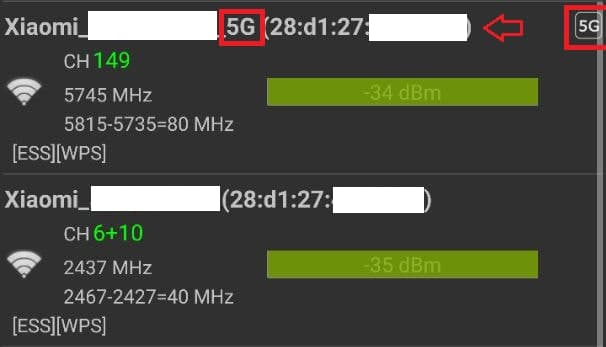

# MiWiFi_Mesh_Node_Adder

Bypasses the need to set the Xiaomi device to Singapore region by adding a node via API

Want to offer me a coffee?
XLM address: `shotokanzh*keybase.io` (stellar account ID: `GAKH7KR4V5KFH5OWC6NL6H4EN6J43VGK4MYA6NNPDHSTBVE6G4SMT4GW`) with proof: https://keybase.io/shotokanzh

## TL;DR
Calling directly the `/api/xqnetwork/add_mesh_node` API is enough to add a new mesh node without the need to switch the main router's region to Singapore. (Tested with Xiaomi firmware global 3.0.22)

## The story
As a christmas gift this year I decided to buy two Xiaomi Mi Aiot AX3600 routers as I noticed that they supported WPA3 / WIFI6 and they could even be connected via **Mesh** either **Wireless** or **Wired** (I am gonna love this one!) and could auto-configure all the IOT devices that I already have at home.

So I proceeded in configuring the router for usage with Italian servers (in the initial configuration the region it's the first thing Xiaomi asks for) but, after configuring the main router, I noticed that it could not see/autoconfigure the secondary router as it didn't appear at all when the router called the `/api/xqnetwork/scan_mesh_node` API, returning a sad:
```json
{"list":[],"code":0}
```

Searching online I noticed that a guy on the Xiaomi forum ([here](https://xiaomi.eu/community/threads/ax-3600-mesh-not-detected.58886/#post-578171)) discovered the origin of the problem:
```
When you reset an AX3600 (global firmware) to add it as a mesh router the default country is singapore
[...]
So your main router must be set to singapore also ( unfortunatly you must reset it if you already have another country)
Once done it will detect the second mesh router.
```

...But, setting the router to Singapore breaks the compatibility with the MiHome app, if you already had devices added to it and, more importantly, **sends data outside the EU**.

I then discovered that, configuring the system to singapore, the system would call the `/api/xqnetwork/add_mesh_node` API, just passing the 5GHz mac address (yes, even if you are connected via wired mesh) and the "room name".

Resetting the device, configuring it to use Italian servers and then calling directly the API passing the 5GHz mac address of the secondary router was enough to have it autoconfigured.

# How to
## What you will need
- IP Address of master router
- Password of master router
- MAC Address (5GHz) of client router

## How to retrieve MAC Address
- Turn on the client router
- Wait for the two lights to turn on (the internet one should be orange, the system one should be cyan/blue)
- Use a wifi scanner app on Android such as [Wifi Analyzer](https://play.google.com/store/apps/details?id=com.farproc.wifi.analyzer)
- Wait for a Xiaomi_network with 5G in the name to appear (**it will take a minute**) and just write down the mac address.



## Usage
Run:
```
python3 -m pip install -r requirements.txt
python3 addmesh.py
```
Just input the ip address of the master router, the password and the mac address of the client.

*The end*.

## Special thanks
- [ScientificHackers](https://github.com/scientifichackers) here on github for the [pymiwifi](https://github.com/scientifichackers/pymiwifi) repository, used for the login part.
- [Oualibadr](https://xiaomi.eu/community/members/oualibadr.281804/) from the Xiaomi forums for the "*Singapore only*" hint
